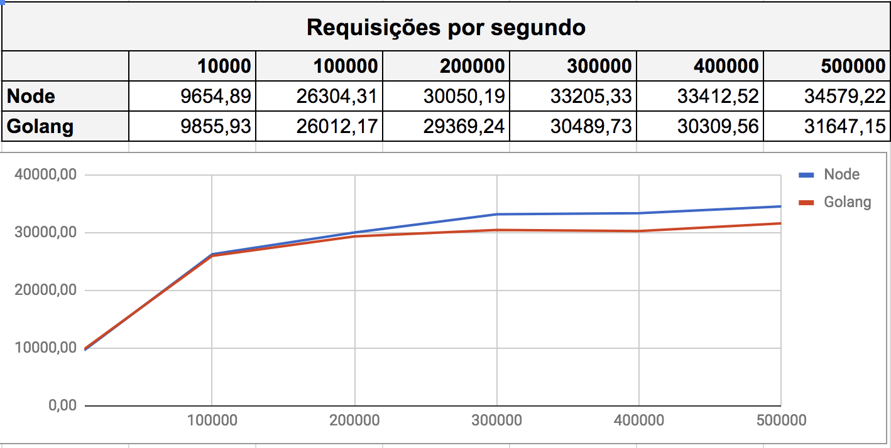
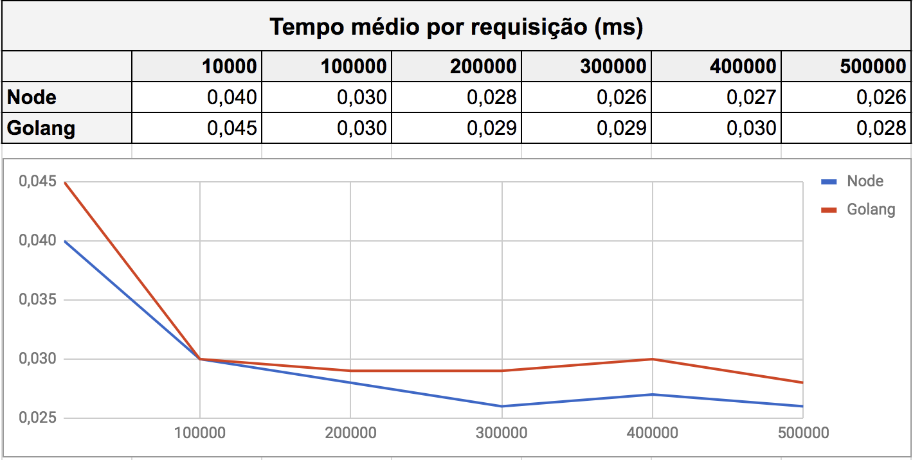
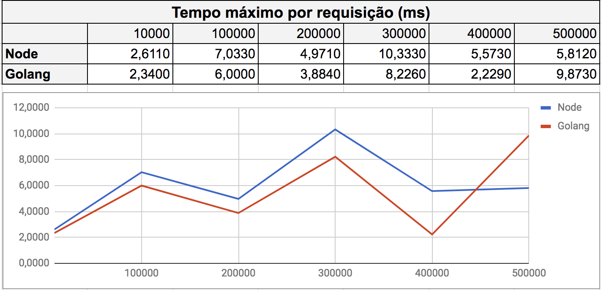
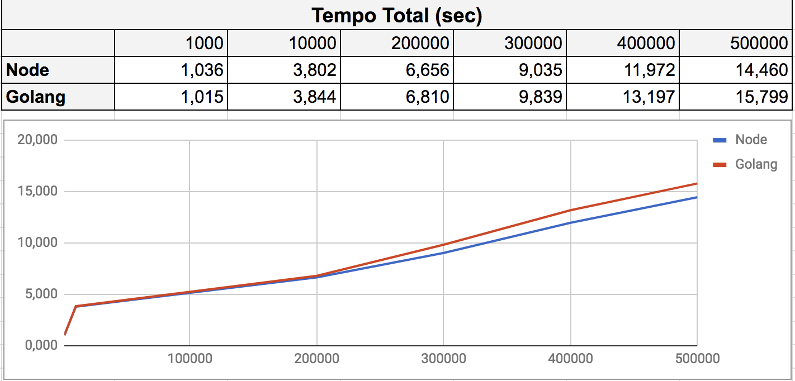

# Benchmark NodeJs x GoLang

## Relatório dos resultados

### Requsições por segundo

### Tempo médio por requisição

### Tempo máximo de uma requisição

### Tempo total

## Log do benchmark
[Node](node-js/results.txt)
[Golang](golang/results.txt)